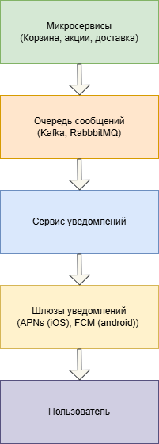

Схема построена на микросервисной архитектуре. Описание блоков:

- **Микросервисы** — источники событий (корзина, акции, доставка)
- **Очередь сообщений** (Kafka/RabbitMQ) — буфер между сервисами
- **Сервис уведомлений** — формирует и отправляет пуш
- **Шлюзы уведомлений** — APNs (iOS) и FCM (Android) доставляют пуш до телефона

Схема

